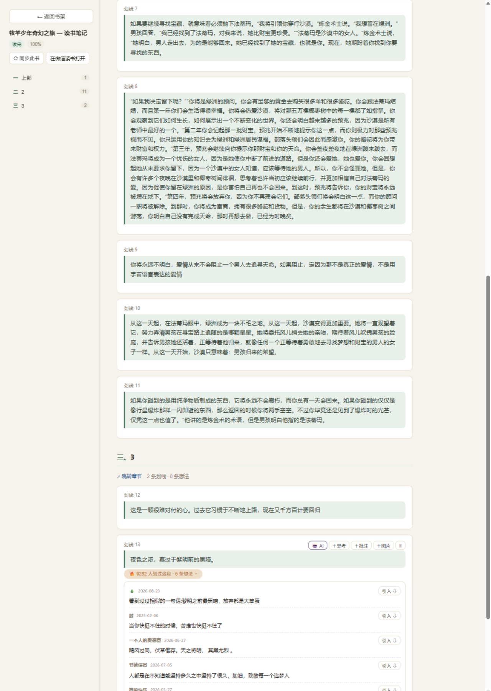

# 微信读书笔记工作台

把微信读书的划线/想法同步为 **Obsidian 原生 Markdown 笔记**的本地 Web 应用：可视化书架、笔记阅读、二次编辑、AI 对话延伸、阅读热力图、同段读者共鸣。数据 100% 在你本地，这个工具只是你 Obsidian 库的「另一个窗口」。




配套文档：[项目说明.md](./项目说明.md)（架构/机制/规范/踩坑/维护，**最全**）· [PRD.md](./PRD.md)（产品需求）· [AGENTS.md](./AGENTS.md)（给 AI 编码代理的项目上下文）· [CHANGELOG.md](./CHANGELOG.md) · [LICENSE](./LICENSE)（MIT）

## 快速开始

**要求**：Node.js ≥ 20 · 一个 Obsidian 库（也可以先没有，用任意空文件夹）· 微信读书 API key（见下方教程）

```bash
git clone https://github.com/jonsins202/weread-workbench.git
cd weread-workbench
# Windows：双击 启动读书工作台.bat    Mac/Linux：./启动.sh
# 也可以从 GitHub Releases 下载免构建压缩包（前端已构建好，解压后 npm install 即可）
```

首次启动会自动安装依赖并构建。浏览器打开 http://localhost:5175 ，在页面引导里填入 API key 和你的 Obsidian 库路径即可开始。

**获取微信读书 API key（每人自己的账号自己的 key）**：

1. 手机打开**微信读书 App** → 「我」→ 设置
2. 找到 **「微信读书 Skill」** 入口
3. 生成/查看 API Key（`wrk-` 开头的一串）
4. 粘贴到工作台设置里（保存在本机，不会上传到任何地方）

注意：key 会过期。过期后界面会提示，重新获取一个、在设置里更换即可。

## 隐私与安全

- 所有笔记数据只写入**你自己的 Obsidian 库**，本工具不托管、不上传任何内容
- API key 只保存在本机配置文件（已被 .gitignore 排除，永远不会进 git）
- 除微信读书官方网关（i.weread.qq.com）和你本机的 claude CLI 外，不连接任何服务器；全部代码开源可审计

## FAQ

**key 过期了怎么办？**
界面会提示同步失败。回到 微信读书 App 重新获取一个 key，在工作台右上角 ⚙ 设置里粘贴保存即可，其它都不用动。

**和 treeboat 等导出类工具有什么区别？**
导出类工具生成快照；本项目是持续的工作台——反复同步幂等（不产生重复块）、你在 Obsidian 里加的思考/AI 批注重同步永不丢失、有编辑器和 AI 对话。核心理念：.md 文件是唯一数据源，本工具随时可以不用，数据无损失。

**我的笔记会被弄丢吗？**
三层保障：同步只写入自管目录 `微信读书笔记/`（库内其它文件一概不碰）；所有写入前做字节级比较、原子落盘；你的批注/想法/AI callout 在重同步时原样保留（有专门的单元测试守着）。建议 Obsidian 库本身用 git 或网盘做版本备份。

**支持什么系统？**
Windows（双击 bat）/ macOS / Linux（./启动.sh）。AI 对话功能需要本机安装 Claude Code CLI，不装也能用其它全部功能。

**端口 5175 被占用？**
config.json 里改 `port` 字段。

## 多设备同步（可选）

把本仓库和你的 Obsidian 库仓库克隆到**同一个父目录下并排放置**，配置默认按 `../` 相对路径找库，换设备无需改路径。开工前 `git pull`、收工后 `git push`（两个仓库都做）。划线/想法等服务器管理的内容在任何设备重新同步即自动收敛；git 真正保护的是你的💭思考、AI 批注等创作内容。`config.json` 与 `.cache/` 不进仓库（每台设备私有）。

**命令行**：

```bash
# 环境要求：Node.js >= 20，环境变量 WEREAD_API_KEY（wrk- 开头）
# 配置：config.json 里填 vaultRoot（Obsidian 库根目录）

npm start                # 启动 Web 工作台（需先 npm run build）
npm run build            # 构建前端
npm run dev / dev:web    # 开发模式（后端热重载 / 前端 Vite 热更新）
npm run sync             # 命令行全量同步（不开界面）
npm run sync -- --dry-run
npm run sync -- --book 牧羊少年
npm test                 # 单元测试
```

## 界面功能（M2）

- **书架页**：封面卡片（状态/进度/划线想法数/同步时间）、搜索、四种排序、全量同步、
  单书同步徽标（服务器有新增时显示「有更新」）、重命名（只改文件名）、删除（物理删除+确认，连带清理图片）
- **笔记页**：左侧章节锚点导航、划线卡片分层展示（原文 → 💭想法/思考 → AI callout → 图片）、
  跳转章节/在微信读书打开（深链）、单书同步
- 手写笔记图片自动下载到 attachments 并在界面显示

## 编辑功能（M3）

- **段级编辑**：每个 💭想法/思考、AI callout 悬停出现 ✎/🗑，行内编辑保存
- **新增**：每条目下可加「💭思考」「批注 callout（四种类型）」「图片」，图片自动存入 attachments 并按规范命名
- **删除**：删除同步条目/想法会记入 frontmatter 隐藏清单（`hidden_keys`/`hidden_ideas`），**下次同步不会复活**；删除笔记连带清理归属图片
- **同步安全**：编辑「服务端想法」= 原想法隐藏 + 编辑稿转为「我的思考」永久保留；条目壳（原文引用）始终保留，挂在下面的用户内容永不丢失
- **并发安全**：每次操作按内容锚点重新定位，Obsidian 里同时改动不冲突；锚点丢失时报错而非盲写
- 同步笔记的划线原文由微信读书管理（不可改）；手动笔记可自由编辑包括原文

## AI 延伸（M4）

- 任意条目上点「🤖 AI」打开右侧对话面板，上下文自动带上：书名 / 章节 / 当前内容 ± 相邻内容（+ 同段读者想法）
- 后端 `claude -p` 非交互调用（prompt 走 stdin），复用本机 Claude Code 订阅与配置；Adapter 预留 codex（config.json 的 `agent.cli` 切换）
- **对话历史服务端持久化**：同一条划线的提问跨刷新/重开面板自动「接着上次」（默认保留 20 轮，可配）；「清空重开」随时从头开始
- 多轮对话（Enter 发送，Shift+Enter 换行）；每次回答可「插入笔记 ⇩」
- 插入前预览最终 Markdown，可选 `example · 🤖 AI 分析` 或 `tip · 🧠 延伸思考` 两种 callout
- 插入 = 追加一个 callout（含问/答），历史内容永不修改，同步永不丢失（实测验证）

## 二期：旧笔记导入（F7）与全库搜索（F8）

**旧笔记导入**（书架页「导入旧笔记」）：
- 输入 vault 内旧笔记路径 → 「分析」出匹配报告（匹配/转仅想法/随笔/图片/去重明细）→ 确认后执行
- 划线式旧笔记按内容锚点挂回对应条目；对不上的（有批注的）带原文进「仅想法」，纯原文无批注的跳过
- 随笔式旧笔记（如 `### 思考 N` 格式）标题转粗体整节进「仅想法」
- 图片复制进 attachments（`{书名}_导入_{原名}` 确定性命名）；重复导入自动去重；旧文件只读不动

**全库搜索**（书架页搜索框）：
- 范围：书名/作者/章节标题/划线原文/想法/思考/批注，跨全部笔记；空格分词 AND
- 结果带类型徽标和命中片段，点击直达笔记页对应条目

**阅读热力图**（书架页顶部卡片）：
- 最近一年每日阅读时长，GitHub 风格格子（绿色四档强度，悬浮看当天分钟数）
- 汇总：近一年总时长 / 阅读天数 / 单日最长 / 活跃日均
- 数据来自微信读书 `/readdata/detail`（逐月拉取合并）；内存+文件双缓存 30 分钟，`?force=1` 强制刷新

**同段共鸣**（笔记页，F9）：
- 你划过的段落若也是全书热门，原文下方出现「🔥 N 人划过这段 · M 条想法」徽标，展开看其他读者的公开想法
- 想法可两步确认「引入」，以 `💬 读者共鸣` callout 落进笔记（Obsidian 原生语法，同步永不丢失；默认只在界面展示、绝不自动写入）
- 对命中条目问 AI 时自动注入这些读者想法作对照参考（面板顶部有提示）
- 笔记底部折叠区展示「你没划过的热门划线 TOP」；数据按 bookId 缓存 24 小时

## 它做什么

- 调微信读书官方 Agent 网关，拉取**划线 + 想法**（treeboat 类工具缺失的想法内容这里全有）
- 在 `{vault}/微信读书笔记/` 生成与手写笔记同构的 Markdown：frontmatter → 章节分组 → 划线（想法挂在原文下）→ 仅想法区
- 想法按 range 精确（含 ±2 容差）挂回对应划线；划线已删除的想法用原文摘录独立成条
- **幂等**：重复同步不产生重复块、不变不写盘（字节级比较）
- **用户内容永不丢失**：你在 Obsidian 里加的 💭思考、图片、AI callout，重同步时原样保留
- 只读写 `微信读书笔记/` 这一个自管目录，库内其它文件一概不碰

## 目录结构

```
server/
  config.js    配置加载（config.json + 环境变量 key 兜底 ~/.bashrc）
  weread.js    网关客户端（notebooks / bookmarklist / review 分页已踩坑适配）
  naming.js    命名规则（杂志紧凑式/完整书名/图片命名/中文数字）
  merger.js    已有笔记解析（用户批注保全的锚点）
  template.js  笔记渲染（确定性排序 + 全局想法去重）
  sync.js      同步编排（幂等比较/原子写入/手动文件识别）
  cli.js       命令行入口
test/          单元测试（node --test，覆盖命名/渲染/幂等/用户内容保全）
```

## 实测踩坑记录（weread 网关）

- `/review/list/mine` 的 `hasMore` 不可靠：hasMore=0 时可能还有数据，`count` 调大到 50 可单页拉全
- 想法的 `range` 末位与划线可能差 1（`17104-17303` vs `17104-17304`），匹配需容差
- `markedStatus==4` 为读完（官方文档写 1=读完，实测不符；1/2/3 含义混杂，按 4 或进度 100 判读完）
- 划线/想法的接口返回顺序不稳定，渲染前必须显式排序
